# 🎵 Real-Time Music Display for OBS Studio

<p align="center">
  <a href="README.md"><b>English</b></a> | 
  <a href="README.zh-TW.md"><b>繁體中文</b></a> | 
  <a href="README.ja.md"><b>日本語</b></a>
</p>

<p align="center">
  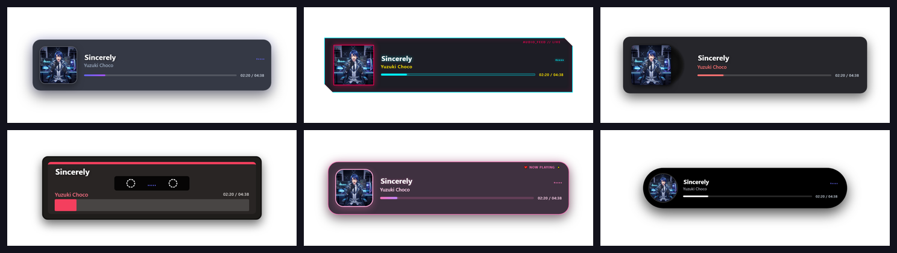
</p>

<p align="center">
  <a href="https://github.com/tokihorokeiya/musicDisplayObs/releases"></a>
  
  
  
  
</p>

---

A modern, standalone desktop tool for Windows that captures currently playing music or video from **YouTube, YouTube Music, Spotify, Apple Music, Chrome, Edge, Firefox, etc.** via Windows System Media Transport Controls (GSMTC) and displays 100% transparent, animated widgets for **OBS Studio** live streams.

* **Zero Browser Extensions** — Works automatically with any media playing in your browser or desktop apps.
* **Direct Drag & Drop into OBS** — Simply drag any preview card or URL box directly into your OBS Studio canvas.
* **23 High-Quality Built-in Themes** — From Glassmorphism, Cyberpunk, and Swiss Style to Retro 70s, 8-Bit Pixel, Bento Grid, Cyber Knight Keiya, and British Pub Belmore.
* **Normal Anti-Aliased CJK Fonts** — Smooth, high-definition ClearType vector fonts for Chinese, Japanese, and Korean characters everywhere.
* **Auto-Marquee Text** — Long song titles and artist names smoothly scroll with seamless looping.
* **Jitter-Free Progress & Timestamps** — Real-time position tracking and synchronized progress bars.
* **1-Click Direct Updates from GitHub** — Check and auto-update to the latest release right from the app without losing your settings.
* **Notion Workspace Aesthetic** — Clean Notion-inspired dark studio UI with non-blocking floating toast notifications.
* **System Tray & Clean Exit** — Minimize to system tray or exit completely on demand.

---

### 🚀 Quick Start

#### Method 1: Standalone Windows App (Recommended - No Python Required)
1. Go to the [Releases Page](https://github.com/tokihorokeiya/musicDisplayObs/releases).
2. Download the latest `OBSMusicDisplay-vX.X.X-windows.zip`.
3. Extract the `.zip` archive to any folder on your PC.
4. Double-click **`OBSMusicDisplay.exe`** to start.

#### Method 2: Run from Python Source
1. Ensure Python 3.10+ is installed on Windows.
2. Clone this repository:
   ```bash
   git clone https://github.com/tokihorokeiya/musicDisplayObs.git
   cd musicDisplayObs
   ```
3. Install dependencies:
   ```bash
   pip install -r requirements.txt
   ```
4. Run via `run.bat` or:
   ```bash
   python main.py
   ```

---

### 🎬 How to Add to OBS Studio

You can add the music overlay to OBS Studio using either of the two methods below:

#### Method A: Direct Drag & Drop (Fastest & Easiest! 🚀)
1. Open both **OBS Studio** and **OBS Music Display**.
2. Simply click and drag any **template preview card**, **URL box**, or **`⠿ Drag into OBS` badge** directly onto the **OBS Studio preview canvas**.
3. OBS Studio will automatically detect the web URL and pop up a confirmation prompt:
   > *"You have dragged a URL into OBS. This will automatically add the link as a source. Continue?"*
4. Click **Yes**. OBS creates the Browser Source automatically!
5. Right-click the newly created source -> **Properties**, set **Width** to `1920` and **Height** to `700`, then click **OK**.

#### Method B: Copy & Paste URL
1. In OBS Music Display, click the **"📋 Copy Global URL"** button (on the main tab) or **"📋 Copy URL"** (in the Template Gallery).
2. In OBS Studio:
   - Under the **Sources** dock, click the **`+`** button and select **Browser**.
   - Paste the link (`Ctrl + V`) into the **URL** field.
   - Set **Width** to `1920` and **Height** to `700` (or `1000` × `400` for compact mode).
   - Click **OK**.

> [!TIP]
> **🌐 Global Active Template Auto-Sync:**
> If you add the Global URL (`http://localhost:11150/overlay`), whenever you switch the active template in the app's main page, OBS Studio will automatically sync and update to that style in real-time without needing to re-copy and paste URLs!

---

### 🎨 19 Built-In Theme Templates

| Theme Name | Style Description | Preview Screenshot |
|---|---|:---:|
| **1. Glassmorphism** | Frosted glass acrylic panel with glowing neon border and smooth blur | 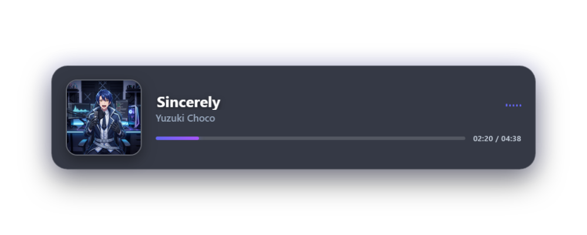 |
| **2. Cyberpunk 2077** | Neon cyan/magenta HUD with digital equalizer soundbars and glitch styling | 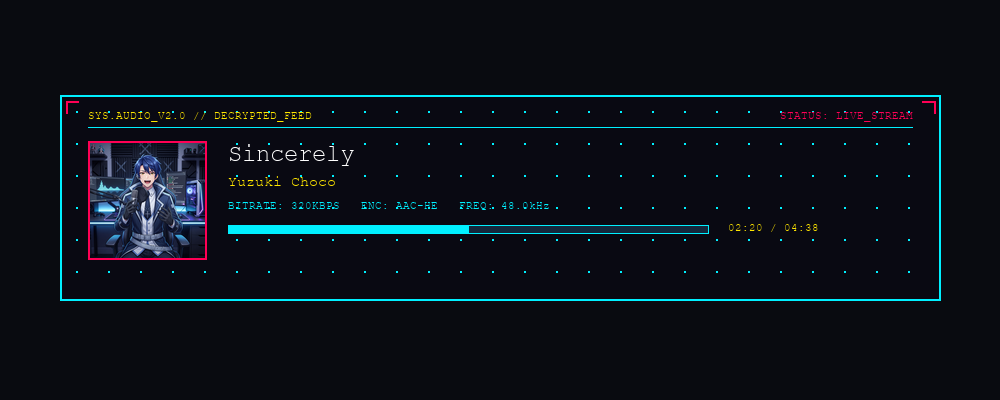 |
| **3. Vinyl Turntable** | Spinning realistic vinyl LP record sliding smoothly from the album sleeve | 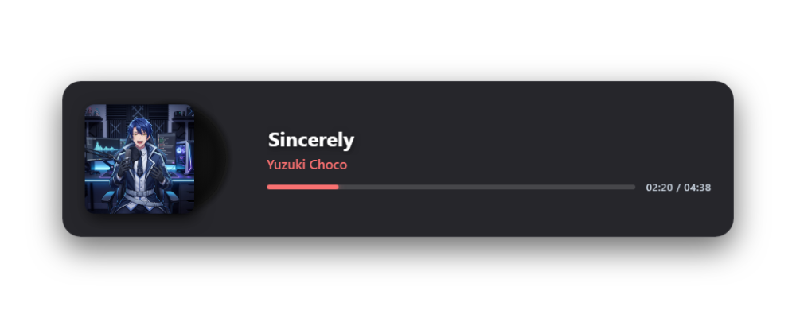 |
| **4. Minimal Pill** | Ultra-clean floating capsule pill badge with auto-scrolling marquee title | 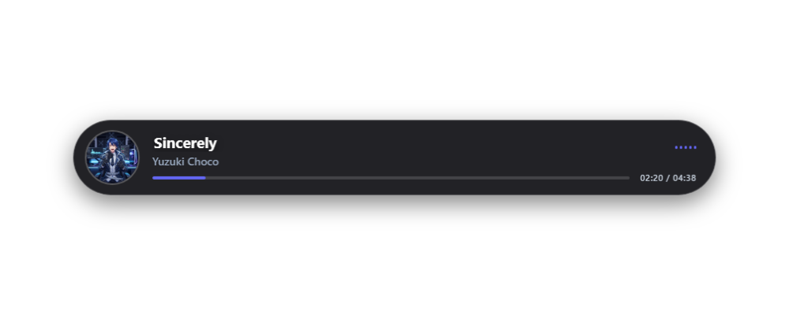 |
| **5. Retro Cassette** | Dual-spool animated vintage cassette tape with warm handwritten song label | 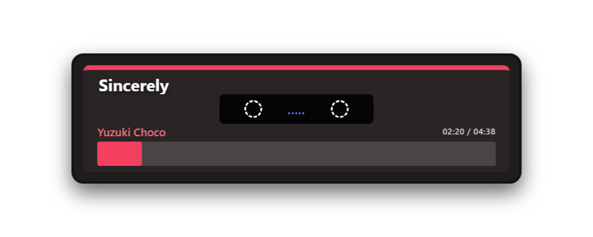 |
| **6. Broadcast Banner** | Clean television lower-third news-ticker layout with streaming status tag | 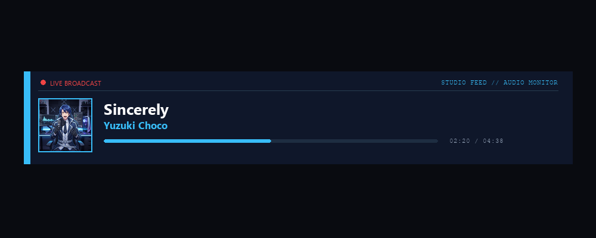 |
| **7. Cute Kawaii** | Soft pastel aesthetic with floating sparkles, hearts, and candy-colored gradients | 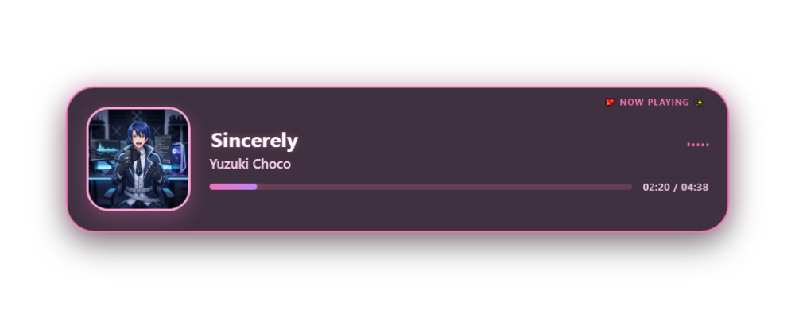 |
| **8. Spotify Card** | Spotify-inspired modern dark card with glowing green active audio equalizer | 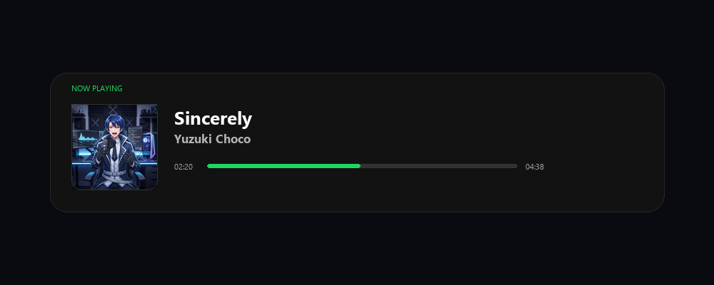 |
| **9. Lo-Fi Cozy** | Warm twilight bedroom vibes with amber string-light glow and soft typography | 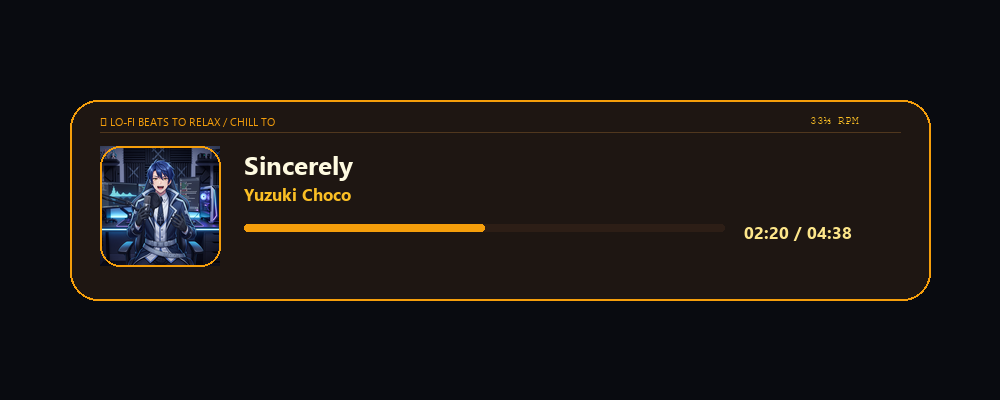 |
| **10. Dynamic Island** | Apple-style floating pill with fluid spring-bounce expansion when music updates | 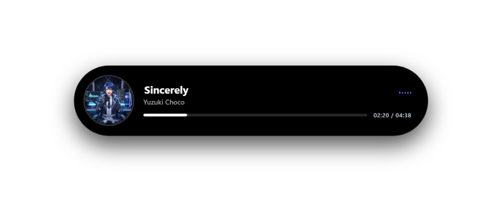 |
| **11. Minimalism** | Ultra-clean typography and high-contrast composition without distractions | 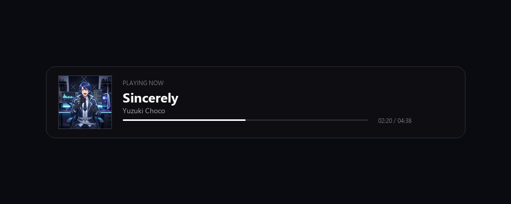 |
| **12. Swiss Style** | International Typographic Style with structured Helvetica grid and clean cross accents | 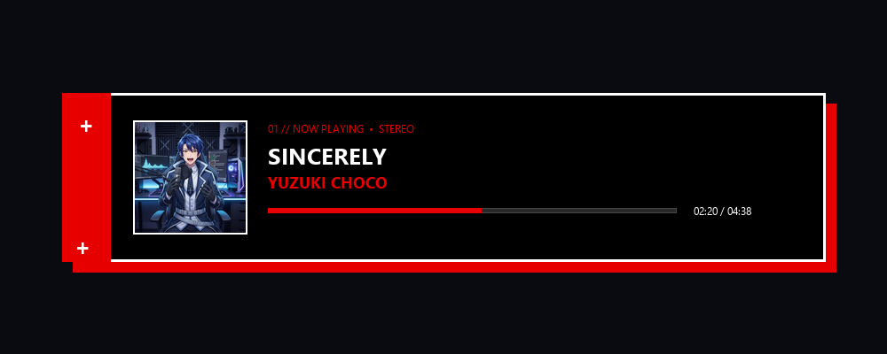 |
| **13. Editorial Magazine** | Vogue & Kinfolk inspired high-fashion editorial print layout with serif aesthetics | 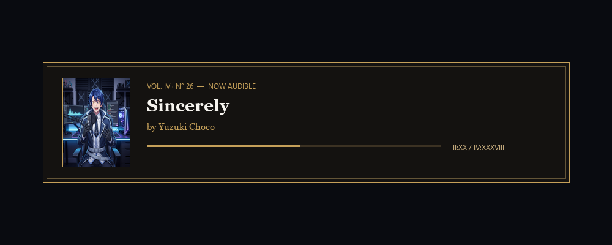 |
| **14. Hand-Drawn Sketchbook** | Playful scrapbook layout with washi tape, paper texture borders, and whimsical notes | 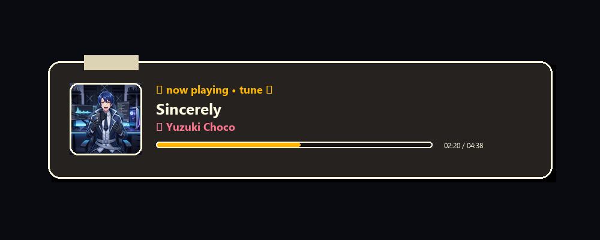 |
| **15. Retro 70s Hi-Fi** | Vintage analog stereo receiver and cassette deck aesthetic with rainbow stripe accents | 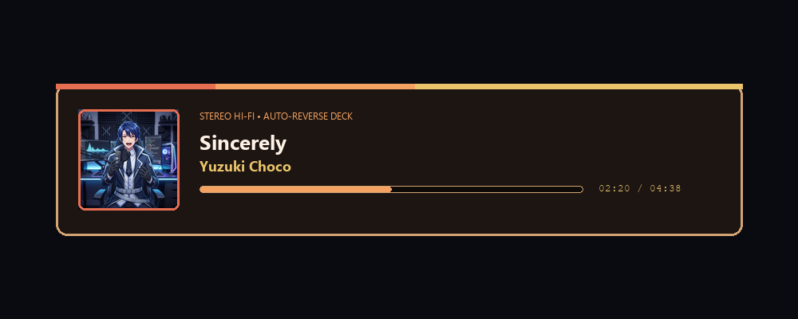 |
| **16. Pixel Arcade** | Retro arcade cabinet CRT monitor aesthetic with synthwave glowing gridlines | 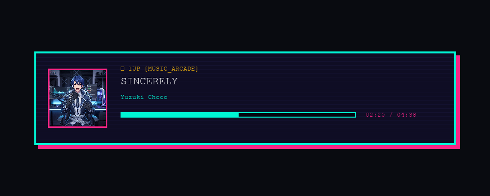 |
| **17. Flat 2.0** | Bold solid blocks, vibrant contrast cards, and modern flat interface hierarchy | 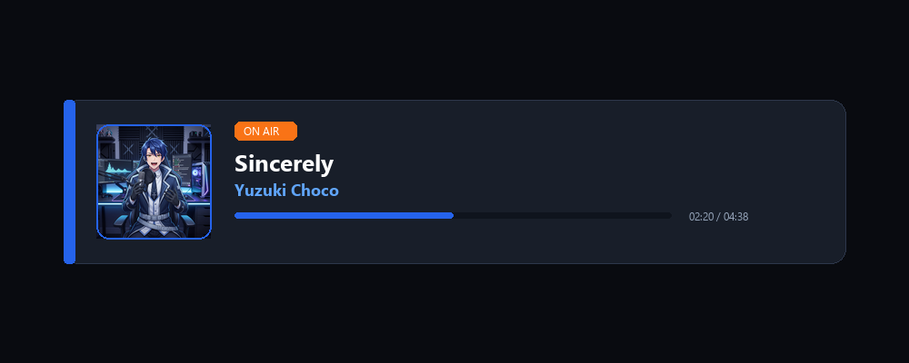 |
| **18. 8-Bit Retro Gaming** | Classic NES / Game Boy green/black retro gaming aesthetic with health-bar timeline | 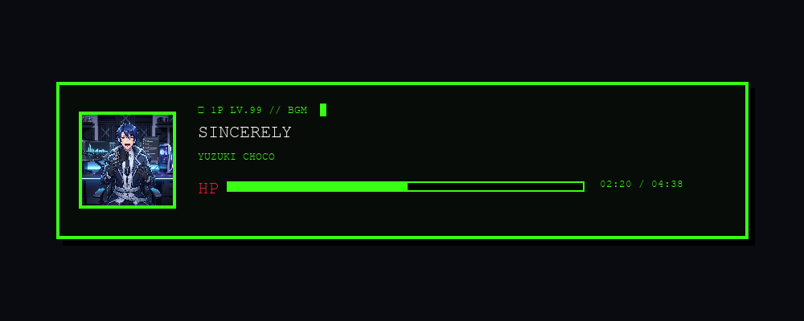 |
| **19. Bento Modular Grid** | Apple-inspired clean modular bento box layout with dedicated live telemetries | 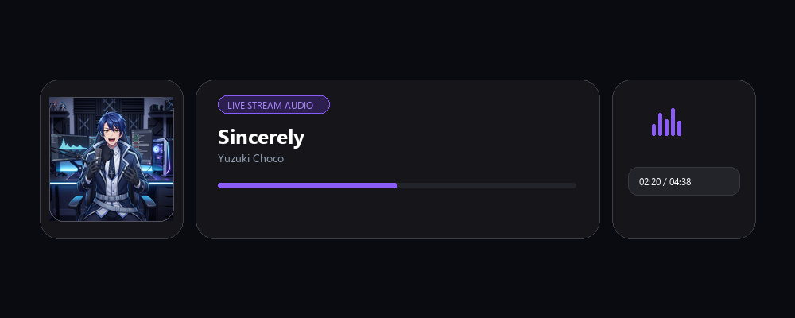 |

---

### ⚙️ URL Parameters & Customization

You can customize any overlay on the fly by appending URL query parameters:

| Parameter | Values | Default | Description |
|---|---|---|---|
| `theme` | `glassmorphism`, `cyberpunk`, `vinyl`, etc. | `glassmorphism` | Visual layout style |
| `autohide` | `1` or `0` | `0` | Automatically hide widget when playback is paused / stopped |
| `delay` | Number (e.g. `3`) | `3` | Seconds to wait before fading out after pausing |
| `w` | Width in pixels | `1920` | Canvas width |
| `h` | Height in pixels | `700` | Canvas height |
| `mode` | `1920x700`, `1000x400`, `1920x1080` | `1920x700` | Pre-configured responsive sizing preset |

**Example URL:**
```
http://localhost:11150/overlay?theme=cyberpunk&autohide=1&delay=3&w=1920&h=700
```

---

### 📄 License

This project is licensed under the MIT License.
